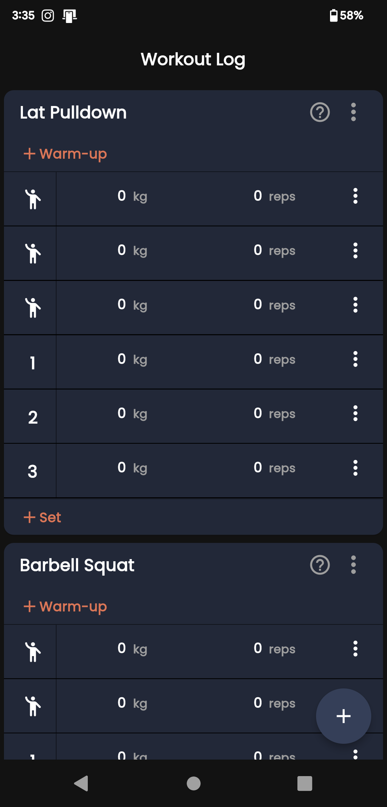

# Workout Log App

The Workout Log App is a mobile application for tracking workout logs and exercises. It provides a user interface to record warm-up sets and working sets for different exercises, allowing users to easily track their progress and maintain a log of their workouts.

## Features

The Workout Log App has the following features:

- View a list of workout logs
- Add a new workout log entry
- Delete a workout log entry
- Add warm-up sets to a workout log entry
- Delete warm-up sets from a workout log entry
- Add working sets to a workout log entry
- Delete working sets from a workout log entry

## Screenshots

*Workout Log Screen*

## Technologies Used

The app is built using the following technologies:

- Flutter: A UI toolkit for building natively compiled applications for mobile, web, and desktop from a single codebase.
- Provider: A state management library for Flutter that simplifies the process of managing app state and sharing data between widgets.

## Installation

To run the Workout Log App locally, follow these steps:

1. Clone the repository: `git clone <repository-url>`
2. Navigate to the project directory: `cd average`
3. Install the dependencies: `flutter pub get`
4. Run the app: `flutter run`

## Usage

Upon launching the app, you will be presented with the Workout Log screen. Here, you can view a list of your workout logs, add new workout log entries, and delete existing entries.

To add a new workout log entry, click the floating action button with the plus icon. This will create a new entry with a default exercise name. You can then add warm-up sets and working sets to the entry by clicking the "Add" buttons.

To delete a workout log entry, click the vertical ellipsis icon at the top-right corner of the entry and select "Delete" from the menu.

To add warm-up sets or working sets to an entry, click the corresponding "Add" button. This will add a new row where you can enter the weight (in kg) and the number of reps.

To delete a warm-up set or working set from an entry, swipe the row to the left to reveal the delete button. Tap the delete button to remove the set.

## Timeline

[Project Total Timeline](https://wakatime.com/@shamith16/projects/mdmzovrgzp?start=2023-05-26&end=2023-06-01)

